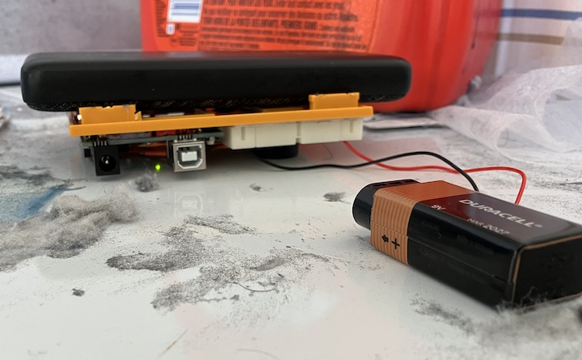
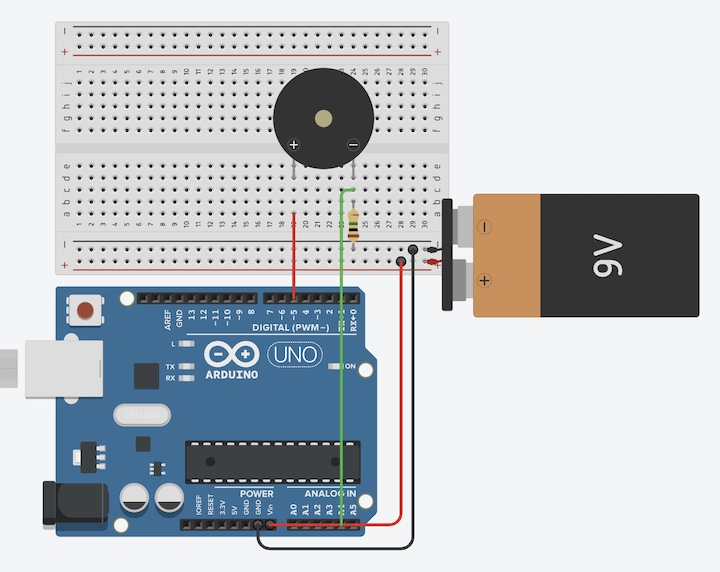
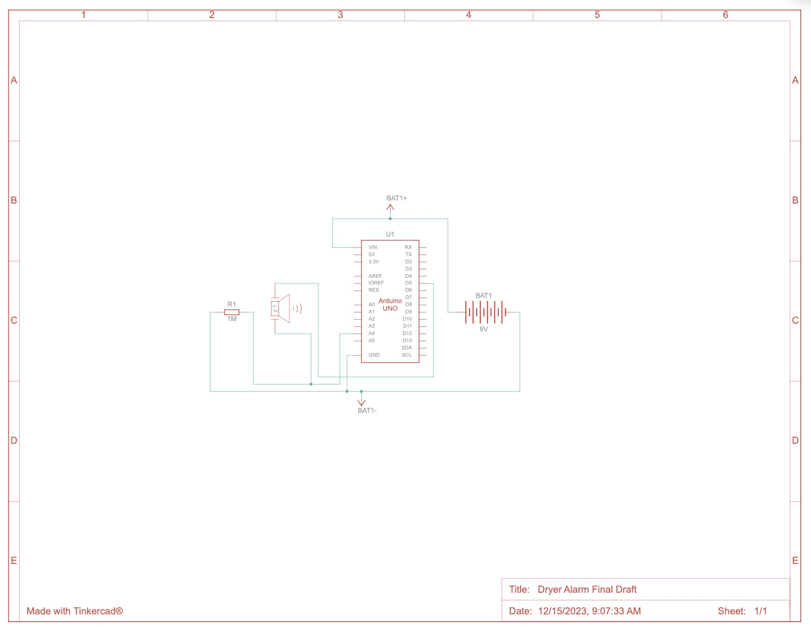
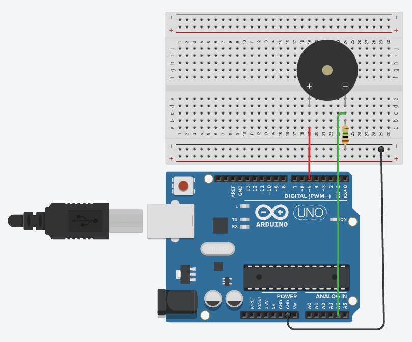
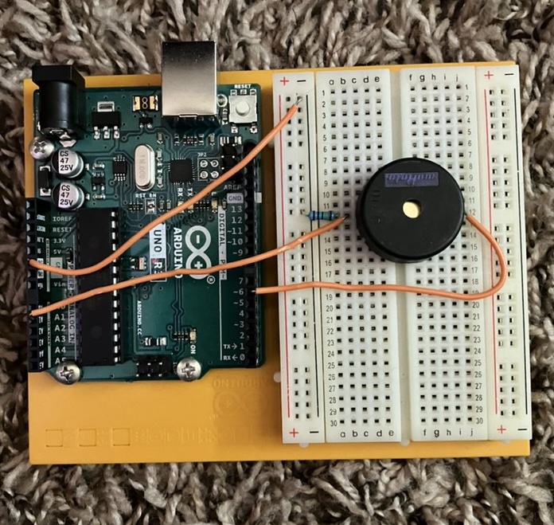
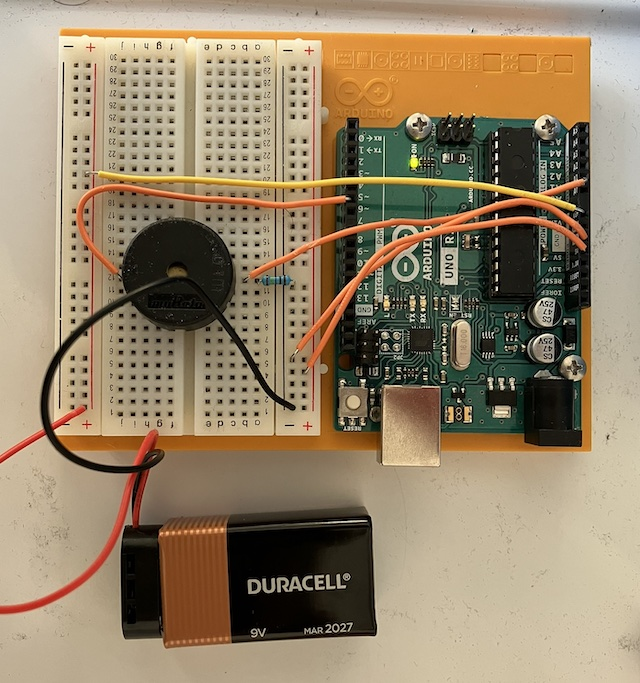

# arduino-dryer-alarm

The dryer in my apartment has the most annoying buzzer but I still want to know when my laundry is finished. I've decided to build my own buzzer to play a sweet, soothing melody to let you know your dryer cycle has completed.

## Post Mortem vid

https://github.com/maffiemaffie/arduino-dryer-alarm/assets/111717714/f08f5730-4273-48fc-b501-dd41e9eb0d21

## Circuit
For the circuit, I use a piezo connected to a digital output pin and an analog input pin.

### Components:
Part|Quantity
-|-
Arduino Uno | 1
Piezo | 1
1 M&Omega; Resistor | 1
9V Battery | 1

## Software
All the code is in the main arduino file. It waits for the vibration from the piezo to stop and then plays the hardcoded melody.

## Project Process
### Planning
I started by putting together a rough sketch in Tinkercad of my project idea:

### Building
I built my ciruit with just the piezo and connected it to the ports. I wrote some really basic code to detect input from the piezo and play tones through it. 

The main issue I kept running into was that the piezo wasn't really detecting the dryer shaking through the breadboard and plastic mount. Ultimately, I solved this by laying the breadboard upside down with the piezo in contact with the dryer and putting something heavy on top to hold it against the dryer.

### Coding
For the code, I came up with a little melody to play at the end and hardcoded it in. The program waits for the dryer's vibration to end and then plays the tune. 

### Final Touches
I tweaked the vibration thresholds and end threshold (so it wouldn't go off when the dryer pauses to change mode). I added a battery so I wouldn't have to leave my laptop plugged in on top of the dryer.

### Cleaning up the circuit
I trimmed all the leads and finished out the circuit:

## Resources
### Similar To: 
- [Arduino - 12 Knock Lock](https://www.youtube.com/watch?v=ca8jwr0i0E0)

### Info Sources:
- [Arduino Language Reference](https://www.arduino.cc/reference/)
- [Frequencies of Musical Notes](https://pages.mtu.edu/~suits/notefreqs.html)

### Spec Sheets:
- [Piezo](https://wiki-content.arduino.cc/documents/datasheets/piezoCapsule.pdf)
